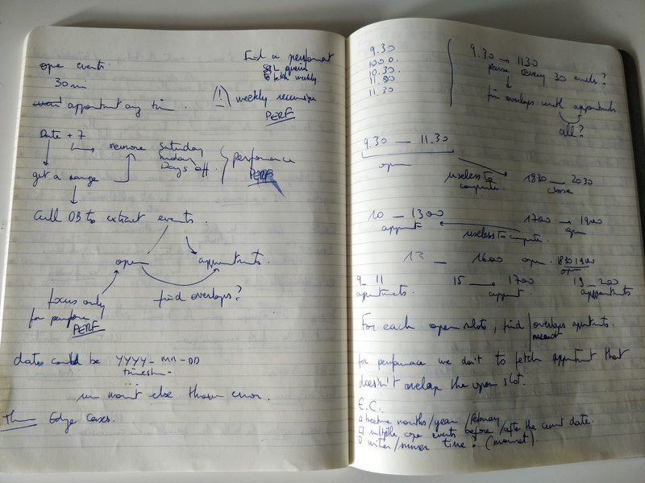

# Le roi boo

> Checks the availabilities of an agenda with Le Roi Boo alias BooKing.

## Objective

The goal is to write an algorithm that checks the availabilities of an agenda depending of the events attached to it. The main method has a start date for input and is looking for the availabilities of the next 7 days.

## MDD (Moleskine Driven Development)



## Analysis

It's  - only - a 200 characters objective but behind this simple description working with date and time could be a quirk thing. ([Timezones](http://tantek.com/2015/218/b1/use-timezone-offsets) are a good example of quirk things).

To be ready to release in production, we have to take care to code expected behaviours and not personal interpretation.

### Hypothesis

To build the library to check the availabilities of an agenda, we need to confirm or refute some hypotheses.

So, could we make the hypothesis that

- [ ] An opening slot has a duration of 30 minutes

- [ ] The opening slot events are always a multiple of 30 min: I mean 30, 60, 90... minutes

```js
[
  {
    kind: 'opening',
    starts_at: new Date('2018-10-01 08:30'),
    ends_at: new Date('2018-10-01 09:00'),
  },
  {
    kind: 'opening',
    starts_at: new Date('2018-10-01 10:00'),
    ends_at: new Date('2018-10-01 11:30'),
  }
]
```

- [ ] An appointment slot has a duration of 30 minutes

- [ ] The appointment slot events are always a multiple of 30 min: I mean 30, 60, 90... minutes

```js
[
  {
    kind: 'appointment',
    starts_at: new Date('2018-10-01 08:00'),
    ends_at: new Date('2018-10-01 08:30'),
  },
  {
    kind: 'appointment',
    starts_at: new Date('2018-10-01 09:00'),
    ends_at: new Date('2018-10-01 11:30'),
  }
]
```

- [ ] The opening slots start always at `x:00` or `x:30`

The hypothesis is related to the start time.

```js
[
  {
    kind: 'opening',
    starts_at: new Date('2018-10-01 08:30'),
    ends_at: new Date('2018-10-01 09:00'),
  },
  {
    kind: 'opening',
    starts_at: new Date('2018-10-01 10:30'),
    ends_at: new Date('2018-10-01 11:00'),
  }
]
```

**VS**

```js
[
  {
    kind: 'opening',
    starts_at: new Date('2018-10-01 08:15'),
    ends_at: new Date('2018-10-01 09:45'),
  },
  {
    kind: 'opening',
    starts_at: new Date('2018-10-01 10:10'),
    ends_at: new Date('2018-10-01 10:40'),
  }
]
```

- [ ] The appointment slots start always at `x:00` or `x:30`

The hypothesis is related to the start time.

```js
[
  {
    kind: 'appointment',
    starts_at: new Date('2018-10-01 08:00'),
    ends_at: new Date('2018-10-01 08:30'),
  },
  {
    kind: 'appointment',
    starts_at: new Date('2018-10-01 09:00'),
    ends_at: new Date('2018-10-01 11:30'),
  }
]
```

**VS**

```js
[
  {
    kind: 'appointment',
    starts_at: new Date('2018-10-01 08:25'),
    ends_at: new Date('2018-10-01 08:55'),
  },
  {
    kind: 'appointment',
    starts_at: new Date('2018-10-01 09:25'),
    ends_at: new Date('2018-10-01 11:55'),
  }
]
```

- [ ] We can schedule an appointment on the Saturday, Sunday and France public bank holidays

The hypothesis is related to the **weekly_recurring** value.

What's the deal about opening slots available on Sunday and public bank holidays.


- [ ] The start and end date time of an opening slot is always on the same day

It means that an opening/appointment slot could not be between 2 days.
The following event should not be valid:

```js
[
  {
    kind: 'opening',
    starts_at: new Date('2018-09-30 22:30'),
    ends_at: new Date('2018-10-01 01:00'),
  }
]
```

- [ ] The start and end date time of an appointment slot is always on the same day

It means that opening/appointment could not be between 2 days.
The following event should not be valid:


```js
[
  {
    kind: 'appointment',
    starts_at: new Date('2018-09-30 22:30'),
    ends_at: new Date('2018-10-01 01:00'),
  }
]
```

- [ ] The timezone is Paris CET.


Some these hypotheses - confirmed or not - may be considered as edge cases.
